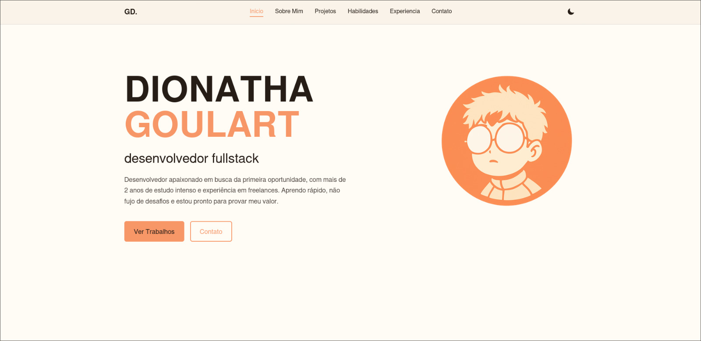
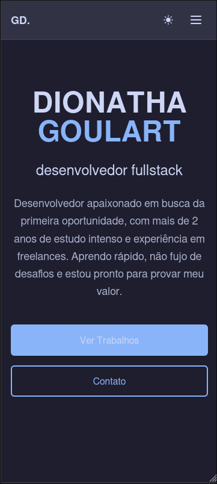

<div align="center">

# 💼 Portfolio Profissional

**Portfolio moderno e responsivo desenvolvido com React, TypeScript e Vite**

[](https://github.com/DionathaGoulart/Portfolio/actions)
[](LICENSE)
[](https://reactjs.org/)
[](https://www.typescriptlang.org/)
[](https://vitejs.dev/)
[](https://tailwindcss.com/)

</div>

---

## 📸 Preview

<div align="center">


<p><em>Visualização desktop do portfolio com tema escuro ativo</em></p>


<p><em>Visualização mobile responsiva do portfolio</em></p>

</div>

---

## ✨ Funcionalidades

### 🎯 Principais Características

- **🌓 Tema Escuro/Claro** - Alternância automática entre temas com detecção do sistema
- **📱 Design Responsivo** - Interface adaptável para todos os dispositivos
- **⚡ Performance Otimizada** - Carregamento rápido com lazy loading e otimizações
- **🎨 Animações Suaves** - Transições e animações com AOS (Animate On Scroll)
- **📊 Analytics Integrado** - Google Analytics 4 com tracking de UTM e eventos
- **📧 Formulário de Contato** - Integração com EmailJS para envio de mensagens
- **🔍 SEO Otimizado** - Meta tags, structured data e otimizações para motores de busca
- **♿ Acessibilidade** - Suporte completo a leitores de tela e navegação por teclado

### 🛠️ Funcionalidades Técnicas

- **🏗️ Arquitetura Modular** - Estrutura organizada com separação de responsabilidades
- **🎯 TypeScript Completo** - Tipagem estática em toda a aplicação
- **🎨 CSS-in-JS com Tailwind** - Estilização moderna com utility-first
- **📦 Bundle Otimizado** - Vite com tree-shaking e code splitting
- **🧪 Qualidade de Código** - ESLint, Prettier e validações automáticas
- **🚀 Deploy Automático** - CI/CD com GitHub Actions e Vercel

---

## 🏗️ Arquitetura do Projeto

```
src/
├── 📁 core/                    # Configuração central da aplicação
│   ├── App.tsx                 # Componente principal
│   ├── main.tsx                # Ponto de entrada
│   ├── routing/                # Sistema de roteamento
│   └── utils/                  # Utilitários globais
├── 📁 features/                # Funcionalidades específicas
│   ├── Analytics/              # Integração Google Analytics
│   ├── Emailjs/                # Serviço de email
│   └── Theme/                  # Sistema de temas
├── 📁 pages/                   # Páginas e seções
│   ├── Home.tsx                # Página principal
│   ├── NotFound.tsx            # Página 404
│   └── Sections/               # Seções do portfolio
├── 📁 shared/                  # Componentes compartilhados
│   ├── layouts/                # Layouts (Header, Footer)
│   └── ui/                     # Componentes de interface
├── 📁 styles/                  # Estilos globais e temas
├── 📁 types/                   # Definições TypeScript
└── 📁 assets/                  # Recursos estáticos
```

---

## 📄 Páginas e Seções

### 🏠 Home

- **Apresentação Pessoal** - Seção de boas-vindas com foto e descrição
- **Navegação Suave** - Menu fixo com scroll suave entre seções
- **Call-to-Action** - Botões para contato e visualização de projetos

### 👨‍💻 Sobre

- **História Profissional** - Jornada e experiência de desenvolvimento
- **Habilidades Técnicas** - Stack tecnológico e competências
- **Objetivos** - Metas profissionais e visão de futuro

### 💼 Projetos

- **Galeria de Projetos** - Grid responsivo com projetos desenvolvidos
- **Sistema de Filtros** - Filtros por categoria (Frontend, Backend, Full Stack)
- **Links Externos** - Acesso direto ao código e demonstrações

### 🛠️ Habilidades

- **Categorias Técnicas** - Frontend, Backend, DevOps, Design
- **Níveis de Proficiência** - Indicadores visuais de domínio
- **Tecnologias Principais** - Stack principal e tecnologias secundárias

### 📞 Contato

- **Formulário Integrado** - Envio direto via EmailJS
- **Informações de Contato** - Email, redes sociais e localização
- **Links Sociais** - GitHub, LinkedIn e outros perfis

---

## 🛠️ Tecnologias Utilizadas

### Frontend

- **React 19.1.1** - Biblioteca principal para interface
- **TypeScript 5.8.3** - Tipagem estática e melhor DX
- **Vite 6.3.5** - Build tool moderna e rápida
- **Tailwind CSS 3.4.17** - Framework CSS utility-first
- **SASS 1.90.0** - Pré-processador CSS para estilos customizados

### Ferramentas de Desenvolvimento

- **ESLint 9.29.0** - Linter para qualidade de código
- **Prettier 3.5.3** - Formatador de código
- **PostCSS 8.5.6** - Processador CSS
- **Autoprefixer 10.4.21** - Prefixos CSS automáticos

### Deploy e CI/CD

- **Vercel** - Plataforma de deploy e hospedagem
- **GitHub Actions** - CI/CD automatizado
- **Lighthouse CI** - Auditoria de performance

### Integrações

- **Google Analytics 4** - Analytics e tracking de eventos
- **EmailJS 4.4.1** - Serviço de envio de emails
- **AOS 2.3.4** - Animações on scroll
- **Lucide React 0.539.0** - Ícones modernos

---

## 🚀 Como Executar

### Pré-requisitos

- Node.js 18+ 
- npm ou yarn
- Git

### Instalação

```bash
# Clone o repositório
git clone https://github.com/DionathaGoulart/Portfolio.git

# Entre no diretório
cd Portfolio

# Instale as dependências
npm install

# Execute em modo desenvolvimento
npm run dev
```

### Scripts Disponíveis

```bash
# Desenvolvimento
npm run dev          # Inicia servidor de desenvolvimento
npm run preview      # Preview da build de produção

# Qualidade de Código
npm run lint         # Executa ESLint
npm run build        # Build para produção
```

---

## 🧪 CI/CD e Qualidade

### GitHub Actions

O projeto possui workflow automatizado de CI/CD:

- **Build & Test** - Validação de build e testes
- **Lint Check** - Verificação de qualidade de código
- **Performance Audit** - Auditoria com Lighthouse CI
- **Deploy Automático** - Deploy na Vercel em push para main

### Ferramentas de Qualidade

- **ESLint** - Linting com regras personalizadas
- **Prettier** - Formatação automática de código
- **TypeScript** - Verificação de tipos em tempo de build
- **Lighthouse CI** - Auditoria de performance e acessibilidade

---

## 🚀 Deploy

### Deploy Automático (Vercel)

O projeto está configurado para deploy automático na Vercel:

- **Produção**: Deploy automático na branch `main`
- **Preview**: Deploy automático em Pull Requests e branch `develop`
- **URL**: `https://dionatha.com.br`

### Configuração Vercel

- **Framework**: Vite
- **Runtime**: Node.js 18
- **Build Command**: `npm run build`
- **Output Directory**: `dist`
- **Install Command**: `npm install`

### Configuração Automática

1. Conecte seu repositório no Vercel Dashboard
2. Configure as variáveis de ambiente necessárias
3. O deploy acontece automaticamente via GitHub Actions

### Workflows GitHub Actions

O projeto possui workflow automatizado:

- **CI/CD** (`ci.yml`) - Build, testes, linting e deploy automático

### Deploy Manual

```bash
# Build para produção
npm run build

# Deploy via Vercel CLI
vercel --prod
```

---

## 📊 Performance

- **Lighthouse Score**: Performance 90+, Accessibility 95+, Best Practices 95+, SEO 90+
- **First Contentful Paint**: < 1.5s
- **Largest Contentful Paint**: < 2.5s
- **Cumulative Layout Shift**: < 0.1
- **Speed Index**: < 3s

---

## 🔧 Configuração

### Variáveis de Ambiente

Crie um arquivo `.env.local` na raiz do projeto:

```env
# Google Analytics
VITE_GA_MEASUREMENT_ID=G-XXXXXXXXXX

# EmailJS
VITE_EMAILJS_SERVICE_ID=your_service_id
VITE_EMAILJS_TEMPLATE_ID=your_template_id
VITE_EMAILJS_PUBLIC_KEY=your_public_key
```

### Personalização

- **Temas**: Configure cores em `src/features/Theme/config/configTheme.ts`
- **Projetos**: Adicione projetos em `src/pages/Sections/Projects.tsx`
- **Informações Pessoais**: Edite dados em `src/pages/Sections/Sobre.tsx`
- **Estilos**: Modifique SCSS em `src/styles/`
- **Ícones**: Substitua favicons em `public/`

---

## 📱 Responsividade

O portfolio é totalmente responsivo e otimizado para:

- **📱 Mobile** (320px - 768px)
- **📱 Tablet** (768px - 1024px)
- **💻 Desktop** (1024px - 1440px)
- **🖥️ Large Desktop** (1440px+)

---

## ♿ Acessibilidade

- **Navegação por Teclado** - Suporte completo a navegação via Tab
- **Leitores de Tela** - ARIA labels e roles apropriados
- **Contraste** - Cores com contraste adequado (WCAG AA)
- **Foco Visível** - Indicadores de foco claros
- **Semântica HTML** - Estrutura semântica adequada

---

## 📈 Analytics

Integração completa com Google Analytics 4:

- **Page Views** - Rastreamento de visualizações de página
- **Event Tracking** - Cliques em botões e links
- **UTM Tracking** - Rastreamento de campanhas e fontes de tráfego
- **User Engagement** - Tempo de permanência e interações

---

## 📄 Licença

**⚠️ ATENÇÃO: Este projeto é de uso exclusivo e pessoal.**

### Direitos Reservados

Este software e sua documentação são propriedade exclusiva do autor e estão protegidos por direitos autorais. É **expressamente proibido**:

- ❌ **Copiar** o código fonte
- ❌ **Modificar** sem autorização
- ❌ **Distribuir** o software
- ❌ **Usar** para fins comerciais
- ❌ **Criar trabalhos derivados**
- ❌ **Fazer engenharia reversa**

### Uso Permitido

- ✅ **Visualizar** o código para fins educacionais
- ✅ **Estudar** a implementação para aprendizado
- ✅ **Inspirar-se** nas ideias e conceitos
- ✅ **Fazer fork** apenas para estudo pessoal

### Consequências

A violação desta licença resultará em:

- Ação legal imediata
- Remoção do conteúdo infrator
- Danos e prejuízos conforme a lei

**© 2025 Dionatha Goulart. Todos os direitos reservados.**

---

## 📞 Contato

**Desenvolvedor**: Dionatha Goulart  
**Email**: dionatha.work@gmail.com  
**Portfolio**: https://dionatha.com.br/  
**GitHub**: https://github.com/DionathaGoulart  
**Linkedin**: https://www.linkedin.com/in/dionathagoulart/

---

<div align="center">

**Feito by Dionatha Goulart**

</div>
